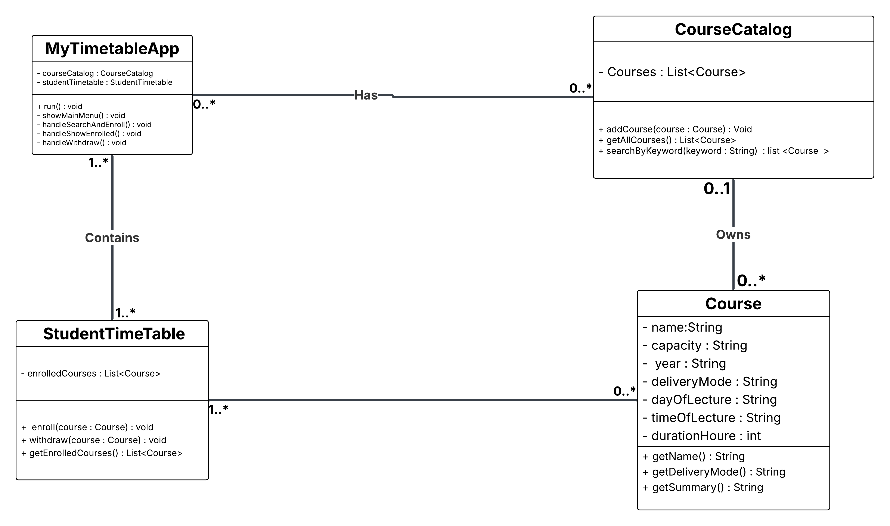

# MyTimetable – Java Console Course Management System

MyTimetable is a console-based course management system written in Java. It allows a student to search available courses, enroll, view their timetable, and withdraw from courses, using an object-oriented design and the Java Collections Framework.

## Overview

- Individual assignment for COSC1295 Advanced Programming (RMIT)
- Focus on Java basics, OO concepts, and Java Collections
- Loads course data from a CSV file and manages a simple student timetable

## Features

1. Load a list of courses from `courses.csv`
2. Search courses by keyword (case-insensitive)
3. Enroll in a selected course
4. View all enrolled courses in a formatted list
5. Withdraw from an enrolled course
6. Exit cleanly via a text-based main menu

## Object-Oriented Design

- **Encapsulation**
  - All instance fields are `private`
  - Access is provided via public methods only where appropriate
- **Classes and responsibilities**
  1. `Course` – represents a single course (name, capacity, year, delivery mode, day/time, duration) and can return a formatted summary line  
  2. `CourseCatalog` – stores all available courses and supports search by keyword  
  3. `StudentTimetable` – stores the current student’s enrolled courses and supports enroll/withdraw operations
  4. `MyTimetableApp` – console controller that shows the menu and coordinates user interaction with the other classes  
- **Relationships**
  - `MyTimetableApp` has associations with `CourseCatalog` and `StudentTimetable`
  - `CourseCatalog` has a composition relationship with many `Course` objects (`List<Course>`)
  - `StudentTimetable` holds references to many `Course` objects via a collection

## UML Class Diagram

The following class diagram shows the main classes in the MyTimetable system and their relationships.



## Technologies

- Java SE 8 or later
- Java Collections Framework (`List`, etc.)
- Console I/O (`Scanner`)
- CSV file as the data source for courses (`courses.csv`)

## How to Run

1. Clone this repository.
2. Ensure `courses.csv` is available in the expected location (for example, project root or a resources folder). 
3. Compile the project, for example:

   ```bash
   javac -d out src/edu/rmit/mytimetable/*.java
   ```

4. Run the main application class:

   ```bash
   java -cp out edu.rmit.mytimetable.MyTimetableApp
   ```

5. Use the menu options to:
   - Search by keyword and enroll
   - Show enrolled courses
   - Withdraw from a course
   - Exit the program

## Example User Flow

1. Start the application and see the main menu.
2. Choose “Search by keyword to enroll” and enter a keyword such as `programming`. 
3. Select a course from the matching list to enroll.
4. Choose “Show my enrolled courses” to view the current timetable. 
5. Optionally choose “Withdraw from a course” to drop a course.

## Code Quality and Practices

- Descriptive class, method, and variable names
- Short, focused methods (no very long methods) 
- Basic comments and/or Javadoc for key classes and methods
- Git used for feature-based commits to track development progress

## Future Improvements

1. Add input validation and more robust error handling
2. Persist the student timetable between runs (file or database)
3. Add unit tests for `CourseCatalog` and `StudentTimetable`
4. Extend the domain model (e.g. special handling for online vs face-to-face courses)

## Learning Outcomes (Personal)

- Practised Java object-oriented design (encapsulation, composition, associations)
- Worked with the Java Collections Framework instead of primitive arrays
- Used Git and GitHub to manage and document a small console application